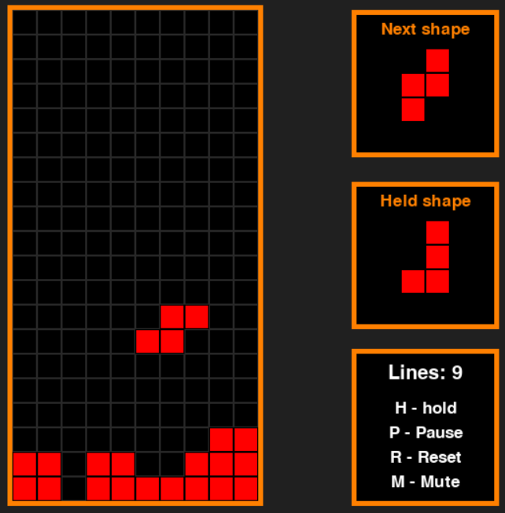

   

Classis Tetris game done in Python with Pygame. I personally love the Tetris game, so as a project i made one myself. The main functionality was implemented with matrix, which represents the playing field, and operations on this matrix. The solution isn't optimal, especially the shapes rotating logic but It was fun little project.

The game is **fully working**.

The **score** is count of filled lines.

The **background music** was created using AI.

## Controls

- **Space** = Start the game
- **WASD** / **Arrows**  = Shape controlling
- **H** = Hold the current shape
- **P** = Pause the game
- **R** = Resets the game
- **M** = Mute the game
- **ESC** = Quits the game

